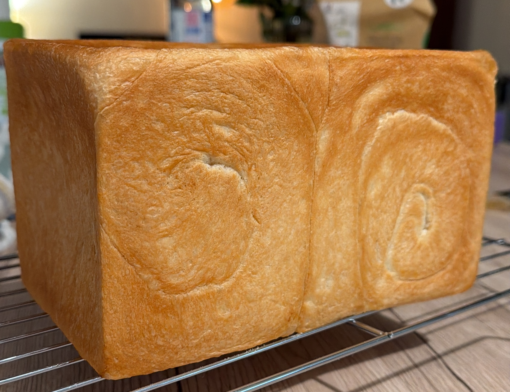

During my [trip to Japan](./japan.qmd), I kept encountering shokupan — thick slices of pillowy white bread sold in every convenience store and bakery. It is nothing like the baguettes I grew up with: incredibly soft and fluffy, slightly sweet, with a rich milky flavor and a tender crumb that somehow stays fresh for days. Back in France, I couldn't find anything close to it, so I decided to learn to make it myself.

## Ingredients

*Makes 1 rectangular loaf (12x12x21cm loaf pan)*

- 250 g warm water (around 40 °C)
- 20 g sugar
- 7 g salt
- 10 g honey
- 7 g instant dry yeast
- 350 g bread flour (high-gluten)
- 20 g powdered milk
- 25 g unsalted butter, at room temperature

**For the pan:**

- ½ tsp neutral oil (for the bowl), or
- 10 g unsalted butter (for the loaf pan)

## Instructions

1. **Activate the yeast** — Combine the warm water, sugar, salt, and honey in a bowl. Add the yeast, whisk briefly, and let rest for 10 minutes in a warm spot until a foamy layer forms on the surface.

2. **Mix the dry ingredients** — Combine the flour and powdered milk in a large bowl or the bowl of a stand mixer. Make a well in the center.

3. **Form the dough** — Pour the liquid mixture into the well. Mix with a spatula or on low speed (speed 2 on a KitchenAid) until no dry flour remains and a rough dough forms.

4. **Knead without butter** — Knead for 3 minutes on low speed to bring the dough together, then increase to medium speed (speed 4) and knead for 5 more minutes. The dough will still be a bit rough but noticeably more cohesive and stretchy. Scrape the sides as needed.

5. **Incorporate the butter** — Add the butter in small pieces, gradually. Knead on low speed for 2–3 minutes until fully absorbed with no visible streaks, then increase to medium speed (speed 4) and knead for 4–5 more minutes.

6. **Final knead** — Increase to medium-high speed (speed 6) and knead for 3–4 minutes, until the dough is very smooth, glossy, and elastic — it should pull away from the sides of the bowl, wrap around the hook, and feel silky. Stop immediately if it becomes soft or sticky.

7. **Windowpane test** — Pinch off a small piece of dough and gently stretch it between your fingers. It should form a thin, translucent membrane without tearing. If it tears, knead for another 1–2 minutes and test again.

8. **First rise** — Shape the dough into a smooth ball by pulling the surface taut. Lightly oil a bowl, place the dough inside, cover, and let rise in a warm place for 40–60 minutes, until roughly tripled in volume.

9. **Degas and divide** — Turn the dough out onto a work surface and press gently to release the gas without tearing. Divide into **3 equal portions** using a scale (or 2 portions — both work well).

10. **Pre-shape and rest** — Shape each portion into a ball with even surface tension. Cover with a damp cloth and let rest for 15 minutes.

11. **Shape** — Roll each ball into a rectangle (about 21 × 26 cm). Fold in thirds lengthwise, then roll it up from the top into a tight spiral log, without pressing too hard.

12. **Pan** — Butter the loaf pan thoroughly. Place the logs seam-side down, side by side, with the spirals facing inward.

13. **Second rise** — Cover and let rise for about 60 minutes, until the dough reaches 80–90% of the height of the pan.

14. **Bake** — Preheat the oven to **220 °C**. Lower the temperature to **210 °C**, slide in the loaf, and bake for **25–30 minutes** until deep golden brown.

15. **Cool** — Remove from the oven and immediately tap the pan on the counter to release steam. Unmold and let cool completely on a wire rack for at least 2 hours before slicing.
